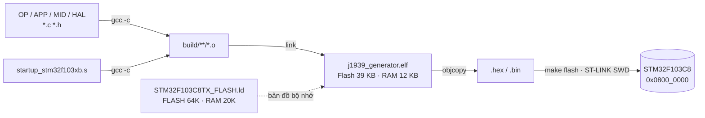
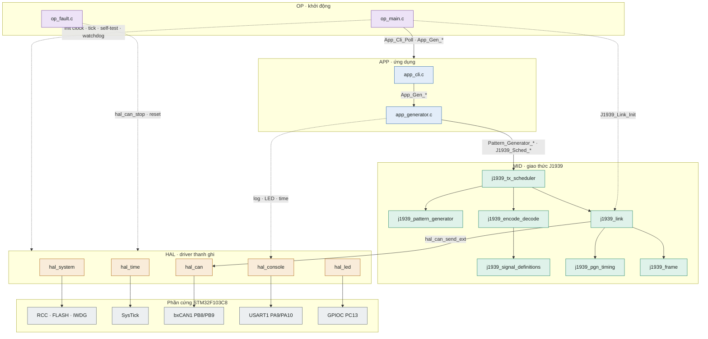
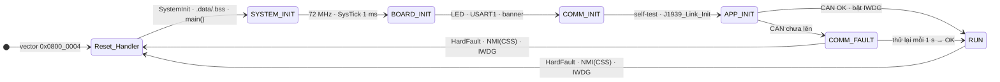
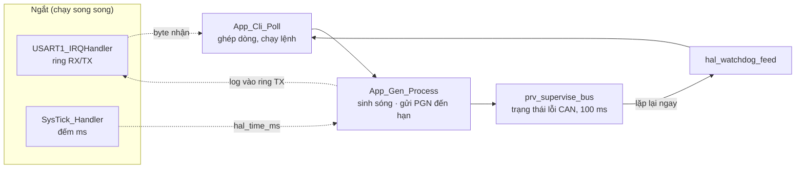
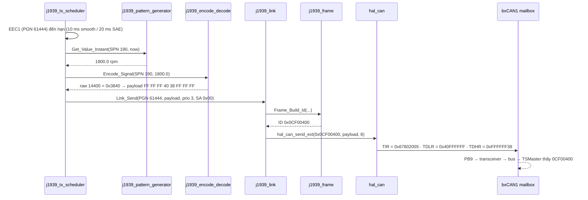

# Reference History

Nhật ký các lần review và đề xuất kỹ thuật cho firmware J1939 trên STM32F103C8. Mục mới nhất nằm trên cùng.

**Quy ước:**
- Mỗi mục có: timestamp (giờ UTC+8), bối cảnh, đề xuất, trạng thái, và commit liên quan nếu có.
- Trạng thái:
  - ✅ Đã làm
  - 🟡 Đang mở
  - 🔵 Đề xuất, chưa quyết định
  - ❌ Bỏ

---

## 2026-09-24 ~11:30 · Sơ đồ workflow firmware (snapshot tại commit `f1b1486`)

**Bối cảnh:** `make flash` đã chạy được. Cần một bản đồ để biết mỗi thư mục/file làm gì và dữ liệu chạy qua đâu. Bản đầy đủ có số liệu nằm ở trang [Bản đồ firmware J1939](https://claude.ai/artifact/48neubDnBrHpyKRKMbwpKf) (trang riêng tư, cần chia sẻ trước khi gửi cho người khác).

Màu theo lớp: 🟪 OP · 🟦 APP · 🟩 MID · 🟧 HAL · ⬜ phần cứng.

### 1. Build và nạp



### 2. Các lớp và ai gọi ai

Lời gọi chỉ đi từ trên xuống. Trong MID, chỉ `j1939_link` được gọi xuống HAL. OP là lớp duy nhất khởi tạo trực tiếp mọi lớp.



Nét đứt là đường gọi ngoại lệ: OP khởi tạo trực tiếp, và APP dùng thẳng `hal_console`/`hal_led`/`hal_time`. Hai header `hal_board_cfg.h` (chân, clock) và `stm32f103_reg.h` (địa chỉ thanh ghi) chỉ dùng bên trong HAL.

### 3. Lifecycle khởi động (`OP/op_main.c`)



| Trạng thái | Việc chính | File |
|---|---|---|
| Reset_Handler | Nạp SP/PC từ vector table, `SystemInit()`, chép `.data`, xóa `.bss` | `startup_stm32f103xb.s`, `hal_system_stm32f1.c` |
| SYSTEM_INIT | FLASH 2 wait state, HSE → PLL ×9 = 72 MHz, APB1 36 MHz, CSS, SysTick | `hal_system_stm32f1.c`, `hal_time_stm32f1.c` |
| BOARD_INIT | LED PC13, USART1 115200, in nguyên nhân reset và tần số clock | `hal_led_stm32f1.c`, `hal_console_stm32f1.c` |
| COMM_INIT | Self-test loopback + silent; clock CAN, remap PB8/PB9, BTR, filter, vào bus | `hal_can_stm32f1.c`, `j1939_link.c` |
| APP_INIT | Nạp 3 tín hiệu mặc định, bắt đầu phát, bật watchdog 2 s | `app_generator.c`, `op_main.c` |
| RUN | Vòng lặp chính (sơ đồ 4) | `op_main.c` |
| COMM_FAULT | LED nháy 10 Hz, CLI vẫn chạy, thử lại CAN mỗi 1 s | `op_main.c` |

### 4. Vòng RUN và ngắt



Vòng lặp không chờ lâu ở bước nào: in log chỉ chép chữ vào ring buffer, còn ngắt USART1 đẩy từng byte ra dây. Nếu vòng lặp kẹt quá khoảng 2 s, IWDG sẽ reset chip.

### 5. Hành trình một frame CAN (EEC1, Engine Speed = 1800 rpm)



### Tra nhanh: muốn sửa gì thì mở file nào

| Muốn thay đổi | Mở file |
|---|---|
| Chân CAN / UART / LED, tần số thạch anh, mức ưu tiên ngắt | `HAL/hal_board_cfg.h` |
| Tần số hệ thống (hệ số PLL, bộ chia bus) | `HAL/hal_board_cfg.h`, `HAL/hal_system_stm32f1.c` |
| Bit timing CAN, bộ lọc nhận frame | `HAL/hal_can_stm32f1.c` (`k_presets`, `prv_config_filters`) |
| Baud CAN mặc định, baud console, chu kỳ telemetry | `APP/app_config.h` |
| Thêm lệnh CLI | `APP/app_cli.c` |
| Thêm SPN / PGN | `MID/j1939_signal_definitions.c/.h` |
| Chu kỳ gửi, priority, source address của PGN | `MID/j1939_pgn_timing.c` |
| Dạng sóng | `MID/j1939_pattern_generator.c` |
| Thứ tự khởi động, watchdog, self-test, thử lại CAN | `OP/op_main.c`, `OP/op_config.h` |
| Vector ngắt, vùng nhớ Flash/RAM, stack | `startup_stm32f103xb.s`, `STM32F103C8TX_FLASH.ld` |

---

## 2026-09-24 ~10:50 · Cấu hình phần cứng bằng thanh ghi và lifecycle trong `op_main.c`

**Bối cảnh:** chuyển sang bare-metal. Mọi thanh ghi được cấu hình dựa trên RM0008 Rev 21. `OP/op_main.c` làm điểm khởi động của hệ thống.
**Commit:** `bda6ee0` (refactor HAL system), `f1b1486` (refactor the main function)

| # | Đề xuất | Trạng thái |
|---|---|---|
| 1 | Clock plan: HSE 8 MHz × PLL 9 = 72 MHz. AHB 72 MHz, APB1 36 MHz (CAN), APB2 72 MHz. FLASH 2 wait state + prefetch (§3.3.3, §7.3.2) | ✅ |
| 2 | Dự phòng khi thạch anh không chạy: HSI/2 × 16 = 64 MHz, APB1 32 MHz, CAN vẫn ra đúng bitrate | ✅ |
| 3 | Bật Clock Security System: nếu HSE hỏng khi đang chạy thì NMI, rồi reset | ✅ |
| 4 | Register map riêng `HAL/stm32f103_reg.h`, kiểm tra offset lúc biên dịch bằng `_Static_assert` | ✅ |
| 5 | CAN remap sang PB8/PB9. Luôn ghi tường minh `SWJ_CFG` (bit chỉ ghi) để không mất SWD | ✅ |
| 6 | Bit timing theo sample point 87.5%. 250k: BRP 9, 1+13+2 TQ. 500k: BRP 4, 1+15+2 TQ (88.9%). SJW 1 TQ | ✅ |
| 7 | Đối chiếu SJW và sample point với bản chuẩn SAE J1939-11/-14 (chưa có tài liệu) | 🟡 |
| 8 | MCR: ABOM=1 (tự thoát bus-off), NART=0, TXFP=0, DBF=1. Filter chỉ nhận frame 29-bit dạng data | ✅ |
| 9 | Self-test CAN ở chế độ loopback + silent trước khi tham gia bus | ✅ |
| 10 | Console USART1 (PA9/PA10) dùng ngắt và buffer vòng; không dùng USB CDC vì CAN và USB dùng chung SRAM | ✅ |
| 11 | Lifecycle: RESET → SYSTEM_INIT → BOARD_INIT → COMM_INIT → APP_INIT → RUN, có nhánh COMM_FAULT tự thử lại | ✅ |
| 12 | Watchdog IWDG khoảng 2 s, tự dừng khi debug halt. Fault handler rời bus CAN rồi reset | ✅ |
| 13 | Startup GCC thay cho bản IAR, kèm Makefile (`make`, `make flash`) | ✅ |
| 14 | Nạp thử lên board: `make flash`, xác nhận self-test PASS và thấy frame trên TSMaster | 🟡 (flash OK 2026-09-24; chưa xác nhận self-test / TSMaster) |
| 15 | Nhận CAN bằng ngắt (IRQ 20) vào buffer vòng, và hàng đợi gửi dùng ngắt TMEIE thay cho đoạn chờ 2 ms | 🔵 |
| 16 | Lập lịch gửi PGN bằng hardware timer, đo jitter thật | 🔵 |
| 17 | Lưu thông tin fault qua reset bằng vùng RAM `.noinit` (cần thêm section vào `.ld`) | 🔵 |

**Kết quả đo:**
- Build thành công: Flash 39 KB/64 KB, RAM 12 KB/20 KB.
- Chưa chạy trên phần cứng.

---

## 2026-09-23 ~16:10 · Review sau khi thêm file `.s` / `.ld` cho STM32F103C8

**Bối cảnh:** đã thêm `startup_stm32f103xb.s`, `STM32F103C8TX_FLASH.ld` và một `Makefile` rỗng.
**Commit:** `266f383` (Add: essential hw file)

| # | Phát hiện / đề xuất | Trạng thái |
|---|---|---|
| 1 | File `.s` là bản IAR (EWARM), GNU as không assemble được. Cần bản GCC | ✅ (2026-09-24) |
| 2 | File `.ld` đúng thông số C8 (RAM 20K, Flash 64K). Nên tăng stack từ 0x400 lên 0x800 | 🟡 |
| 3 | Chọn hướng build bare-metal. Viết lại các port HAL, bỏ phụ thuộc Arduino | ✅ (2026-09-24) |
| 4 | Đổi board sang C8: LED PC13 sáng mức thấp, console qua USART1 | ✅ (2026-09-24) |
| 5 | `PGN_EEC2` đang là 61442 (0xF002, trong chuẩn là ETC1). Theo SAE phải là 61443 | 🟡 |
| 6 | `t_start` / `t_dur` được CLI nhận nhưng pattern generator không dùng | 🟡 |
| 7 | Thời gian chờ 5 s lúc khởi động bị hard-code và trả về 0.0; nên cho cấu hình hoặc gửi 0xFF | 🟡 |
| 8 | 9/23 PGN chưa có trong bảng timing (đang dùng mặc định 1000 ms, priority 6) | 🟡 |
| 9 | Baud mặc định 500 kbps, trong khi tài liệu ghi 250 kbps; cần thống nhất | 🟡 |
| 10 | Jitter do log in theo kiểu blocking: đã chuyển console sang dùng ngắt; phần lập lịch bằng timer vẫn còn mở | 🟡 |
| 11 | Tính năng J1939 mới: RX + Request PGN, TP BAM/CMDT, DM1, Address Claim, chế độ tiêm lỗi | 🔵 |
| 12 | Commit `a5dcd39` đã xóa `web/` (dashboard). Cần xác nhận việc này là cố ý | 🟡 |
| 13 | Test chạy trên PC + CI; database dùng một nguồn duy nhất (YAML sinh ra cả C và DBC) | 🔵 |
| 14 | Patent: liệt kê các claim kỹ thuật (tính giá trị tức thời lúc gửi, 3 profile timing, vòng khép kín), tìm hiểu giải pháp đã có, làm việc với luật sư sở hữu trí tuệ | 🔵 |

**Kết quả đo:**
- Test database: 52 SPN / 23 PGN, encode rồi decode lại đúng, không có SPN chồng bit.

---

## 2026-09-23 ~15:30 · Tách lớp APP / MID / HAL

**Bối cảnh:** tái cấu trúc mã nguồn từ một file `.ino` duy nhất thành các lớp rõ ràng.
**Commit:** `a5dcd39` (feat: create sourcing folder)

| # | Đề xuất | Trạng thái |
|---|---|---|
| 1 | Xóa bản trùng của `j1939_can_helper.*` giữa MID và HAL | ✅ |
| 2 | HAL không được biết về J1939. Chuyển phần build/parse CAN ID sang `MID/j1939_frame` | ✅ |
| 3 | Thêm `MID/j1939_link` làm module MID duy nhất gọi `hal_can` | ✅ |
| 4 | Chuyển bảng timing PGN từ APP sang `MID/j1939_pgn_timing` | ✅ |
| 5 | Chuyển vòng gửi frame từ `loop()` sang `MID/j1939_tx_scheduler` | ✅ |
| 6 | Tách `.ino` thành `app_cli`, `app_generator`, `app_config` | ✅ |
| 7 | Quy tắc phụ thuộc chỉ đi xuống: (OP →) APP → MID → HAL | ✅ |
| 8 | Sửa lỗi: `STATUS` in sai mode; `CONFIG` báo ACK dù bảng signal đã đầy | ✅ |
| 9 | Thêm build system (PlatformIO hoặc Makefile) | ✅ (Makefile, 2026-09-24) |

---

## Thêm mục mới

```markdown
## YYYY-MM-DD HH:MM · <Chủ đề>

**Bối cảnh:** ...
**Commit:** `<hash>` (<message>)

| # | Đề xuất | Trạng thái |
|---|---|---|
| 1 | ... | 🔵 |
```

Khi một đề xuất cũ được xử lý, cập nhật trạng thái ở mục gốc và ghi ngày hoàn thành, ví dụ `✅ (YYYY-MM-DD)`.
